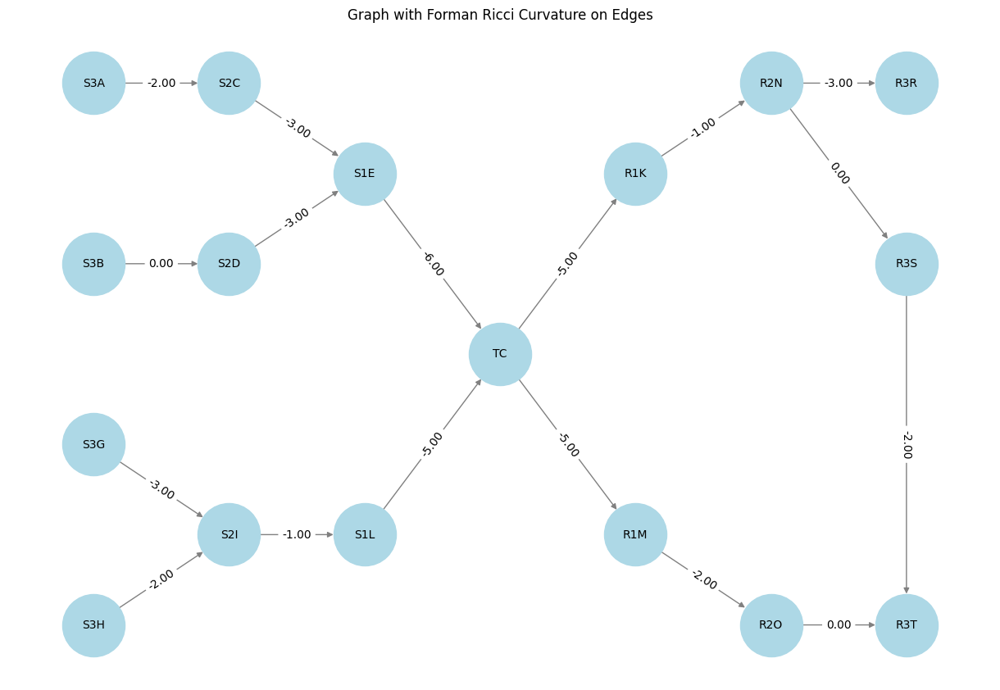

# FormanRicciAnalysis

This repository provides a Python implementation for computing and visualizing Forman-Ricci curvature on a directed, weighted graph. Using the NetworkX library, this project analyzes edge-level properties of a graph to understand its local geometric and structural properties.

## Features
- Constructs a weighted, directed graph with predefined nodes and edges.
- Calculates Forman-Ricci curvature for each edge using the formula:

  **FRC(e) = w(e) - (deg(v1) + deg(v2))**

  Where:
  - **w(e)**: Weight of the edge.
  - **deg(v1)** and **deg(v2)**: Degrees of the incident vertices.

- Visualizes the graph with curvature values annotated on each edge.
- Offers a custom node layout for improved clarity in visualization.

## Example Graph Visualization
Below is an example of the graph generated by the script, with Forman-Ricci curvature values displayed on the edges.

## How to Run
1. Clone the repository:
   ```bash
   git clone https://github.com/<your_username>/FormanRicciAnalysis.git
   cd FormanRicciAnalysis
   ```
2. Install the required dependencies:
   ```bash
   pip install networkx matplotlib
   ```
3. Run the script:
   ```bash
   python main.py
   ```

## Applications
- **Network Analysis:** Identify dense clusters and sparse regions in the graph.
- **Edge-Level Insights:** Understand bridge edges and local connectivity.
- **Visualization:** Provide graphical representations of curvature for research and analysis.

## References
This implementation and the simplified formula for Forman-Ricci curvature are based on adaptations and interpretations found in the following works:

1. Forman, R. "Bochner's Method for Cell Complexes and Combinatorial Ricci Curvature." Discrete & Computational Geometry, 2003. [Link](https://link.springer.com/article/10.1007/s00454-002-0760-1)
2. Ni, C.C., Lin, Y.Y., Gao, J., Gu, X., & Saucan, E. "Ricci curvature of the Internet topology." INFOCOM, 2015. [DOI](https://doi.org/10.1109/INFOCOM.2015.7218428)
3. Sreejith, R.P., Jost, J., Saucan, E., & Samal, A. "Forman curvature for directed networks." [arXiv](https://arxiv.org/abs/1605.04662)


